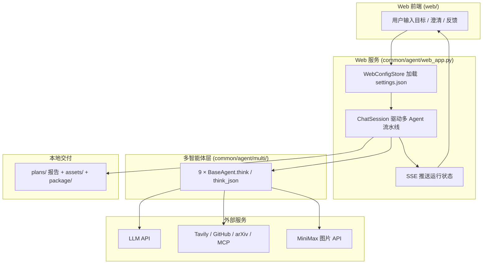
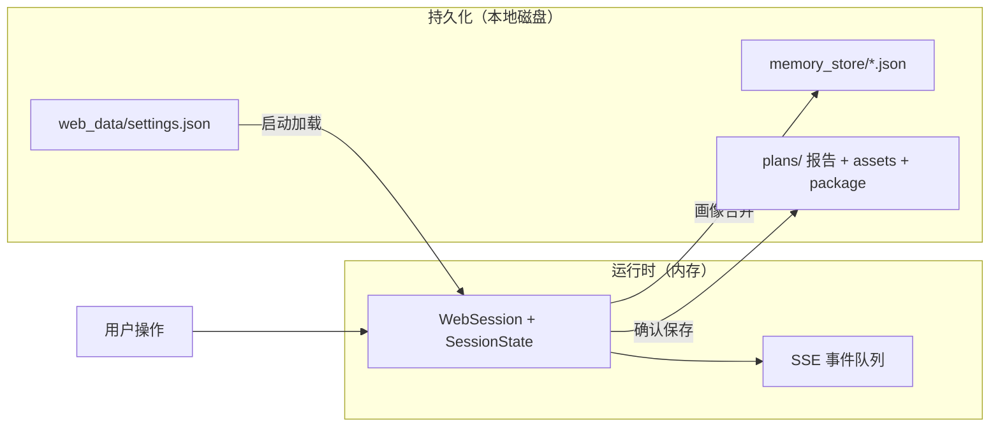
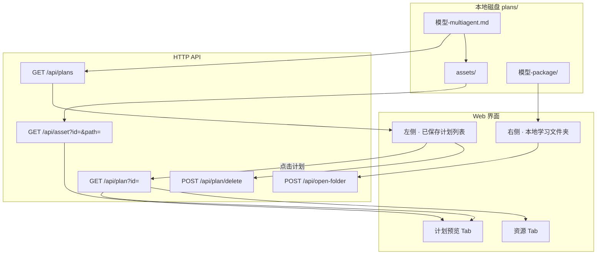
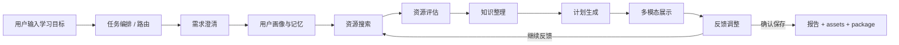

> **README v2（扩展版）**  
> 在仓库原版 [`README.md`](README.md) 基础上补充：整体架构与技术栈、存储分层、`plans/` 落盘与 Web 前端对应、推荐资源 Tab 修复说明、课程作业对齐要点。  
> 团队协作与 GitHub 首页展示仍以 `README.md` 为准；答辩与课程文档提交可参考本文件。

# Study Planner Agent - 智能学习规划多智能体系统

Study Planner Agent 是一个面向个人学习者的本地智能学习规划系统。它把学习目标澄清、用户画像记忆、真实资源检索、资源评估、知识整理、计划生成、多模态展示、反馈调整和最终执行包导出串成一条稳定的多 Agent 主链路。

项目当前支持两种使用方式：

- 本地 Web 工作台：类 ChatGPT/Claude 的对话体验，支持设置模型、联网搜索、全局记忆、主题外观、已保存计划列表和本地文件夹入口。
- 命令行入口：通过 `providers/minimax.py`、`providers/kimi.py`、`providers/deepseek.py` 直接运行多智能体流程。

最终交付不是一份单纯的 Markdown 报告，而是一套可执行学习文件：

```text
plans/<学习目标>/
  <model>-multiagent.md          # 完整最终报告，canonical report
  assets/                        # 封面图、结构图、成果图、产出物图等
  <model>-package/
    plan.md                      # 最终计划副本
    daily-checklist.md           # 每日/每周任务清单
    review-log.md                # 复盘日志模板
    quiz.md                      # 阶段自测题
```

## 整体架构概览

Study Planner Agent 采用**固定主链路的 9 智能体流水线**：每个 Agent 是独立的 LLM 角色（独立 system prompt + `provider.chat()` 调用），由 `pipeline.py` 按序调度，共享同一份 `SessionState` 会话状态，最终落盘为本地学习文件包。架构图见 `docs/assets/architecture.png`。

### Web 工作台三栏布局

本地 Web 工作台（`http://127.0.0.1:8765`）将多智能体流程映射为类 ChatGPT 的操作界面：

| 区域 | 职责 | 对应后端 |
| --- | --- | --- |
| 左侧栏 | 新建学习规划、已保存计划列表、设置入口（模型 / 搜索 / 记忆） | `GET/POST /api/plans`、`/api/settings` |
| 中间栏 | 智能规划对话：目标输入 → 澄清卡片 → 草稿生成 → 反馈与保存；SSE 实时展示 Agent 运行状态 | `/api/chat/*`、`/api/events` |
| 右侧栏 | 本地学习文件夹：计划预览、资源卡片、最终产物路径（`plan.md`、`daily-checklist.md` 等） | `/api/plans/{id}`、`/api/assets` |

用户只需在设置中配置主模型、MiniMax 图生成和 Tavily 搜索，输入学习目标后点击「生成澄清问题」，即可走完澄清 → 多 Agent 生成 → 反馈调整 → 确认保存的完整链路。

### Agent 三要素落地

| 要素 | 实现方式 | 关键模块 |
| --- | --- | --- |
| **记忆** | 本轮 `SessionState` 保存目标、澄清、资源、计划草稿；`memory_store/` 持久化用户画像；`soul-instr/` Markdown 规则约束什么该记、如何合并 | `state.py`、`memory_store.py`、`ProfileMemoryAgent` |
| **规划** | `pipeline.py` 固定编排 9 个 Agent；`RouterAgent` 识别领域与关键词；`PlanGenerationAgent` 输出分阶段计划；`FeedbackAdjustmentAgent` 根据反馈触发资源重搜或计划修订 | `pipeline.py`、`agents.py` |
| **工具** | `ToolRegistry` 统一注册与调用；资源搜索（Tavily / GitHub / arXiv / MiniMax MCP）、正文抓取、M3 图片生成、本地 SVG 兜底 | `tools/registry.py`、`web_search.py`、`image_gen.py`、`diagram_render.py` |

### 9 个智能体与五层映射

```text
用户输入层     web/ + interaction.py
    ↓
调度与记忆层   RouterAgent → ClarificationAgent → ProfileMemoryAgent
    ↓
搜索与分析层   ResourceSearchAgent → ResourceEvaluationAgent → KnowledgeOrganizationAgent
    ↓
规划与优化层   PlanGenerationAgent → MultimodalDisplayAgent → FeedbackAdjustmentAgent
    ↓
输出交付层     pipeline._save() + package.export_learning_package() + display.py
```

反馈环节若涉及资源类诉求（换中文、要实战、太难等），`FeedbackAdjustmentAgent` 会将流程回退到资源搜索层重新检索，而非仅修改报告文字。

## 技术栈

| 层级 | 技术选型 | 说明 |
| --- | --- | --- |
| **语言与运行时** | Python 3.11+ | 多智能体核心、Web 服务、工具调用、文件导出 |
| **HTTP 客户端** | `httpx>=0.27.0` | 调用 LLM Chat API、抓取网页正文、第三方搜索 API |
| **Web 后端** | Python 标准库 `http.server.ThreadingHTTPServer` | 无 Flask / FastAPI / Django；REST + 静态资源一体 |
| **Web 前端** | 原生 HTML + CSS + JavaScript | 无 npm、无 React/Vue；`web/index.html`、`app.js`、`styles.css` |
| **实时通信** | Server-Sent Events (SSE) | 中间栏实时推送 Agent 运行阶段与日志 |
| **持久化存储** | 本地文件系统（见下文「存储架构」） | 无 Redis / 无关系型数据库；单机本地优先 |
| **大语言模型** | MiniMax M3/M2.7、Kimi k2 系列、DeepSeek V4 系列 | `providers/*_impl.py` 适配 OpenAI 兼容 Chat Completion 接口 |
| **联网搜索** | Tavily API、GitHub Search、arXiv、MiniMax Web Search MCP | 多源并行检索，失败时降级为纯模型生成 |
| **多模态生成** | MiniMax M3 / image-01 图片 API + 本地 SVG | 知识图、路线图、流程图等优先 PNG，不可用则 `diagram_render.py` 回退 |
| **规则与 Prompt** | `soul-instr/*.md` | 记忆策略、画像 Schema、合并规则以 Markdown 注入 Agent |
| **测试** | `unittest` | `tests/test_*.py` 覆盖 Web、流水线、资源、多模态与执行包 |

### 请求与数据流（简化）



## 存储架构（分层设计）

本项目将**运行时状态**与**持久化数据**刻意分离：Agent 业务逻辑不直接依赖 Redis 或数据库，全部通过路径约定读写本地文件；仅在 Web 服务进程内用内存承载「进行中」的会话。

### 四层存储职责

| 层级 | 存储介质 | 路径 / 载体 | 生命周期 | 职责 |
| --- | --- | --- | --- | --- |
| **配置层** | JSON 文件 | `web_data/settings.json` | 持久化 | API Key、模型选择、Tavily Key、全局记忆、深度思考开关 |
| **会话层** | 进程内存 | `WebPlannerService.sessions` | 服务重启后丢失 | 进行中的 `SessionState`、澄清题、SSE 事件队列、草稿状态 |
| **记忆层** | JSON 文件 | `memory_store/<目标slug>.json` | 跨会话持久化 | 用户画像（基础、时间、偏好）；由 `ProfileMemoryAgent` 读写 |
| **交付层** | Markdown + 图片 + 目录 | `plans/<学习目标>/` | 确认保存后永久落盘 | 报告、assets 图片、执行包四文件；左侧计划列表扫描此目录 |

规则与 Prompt 库（`soul-instr/*.md`）只读挂载，不属于用户数据，但会注入记忆 Agent 的 system prompt。

### 存储数据流



- **澄清 / 生成 / 反馈**：只改内存中的 `SessionState`，不落库。
- **画像记忆**：`ProfileMemoryAgent` 将合并结果写入 `memory_store/`，下次相似目标自动加载。
- **确认保存**：`pipeline._save()` + `export_learning_package()` 一次性写入 `plans/`，Web 左侧列表通过扫描 `*-multiagent.md` 展示。详见下文「plans/ 落盘与 Web 前端对应」。

## plans/ 落盘与 Web 前端对应

`plans/` 是本项目**唯一的学习计划交付目录**：磁盘上的文件夹就是「数据源」，Web 端不维护独立数据库，只通过 API 扫描、读取、展示本地文件。

### 1. 什么时候写入 `plans/`？

只有用户在 Web 端点击 **「保存最终文件」**（或命令行流程走到确认保存）时才会落盘。此前的澄清、生成、反馈阶段都只在内存 `SessionState` 中，**不会**提前写入 `plans/`。

保存调用链：

```text
Web「保存最终文件」
  → POST /api/session/save
  → WebPlannerService.save()
  → save_final_artifacts()
       ├─ pipeline._save()           # 写 canonical 报告
       └─ export_learning_package()  # 写执行包四文件
```

核心代码：`common/agent/web_app.py`（Web 保存入口）、`common/agent/multi/pipeline.py`（`_save`）、`common/agent/multi/package.py`（执行包）。

### 2. 目录名（slug）怎么来的？

目录名由用户本轮的 **原始学习目标** `state.raw_goal` 经 `common/storage.py` 的 `resolve_plan_dir()` 规范化得到：

1. 非字母数字、中文、连字符的字符 → 替换为 `-`
2. 合并连续 `-`，去掉首尾 `-`
3. **截断到 80 字符**

因此同一学习目标多次保存会写入**同一文件夹**（覆盖同模型的报告；图片在 `assets/` 中追加或更新）。

示例（实际路径可能因目标文本截断而较长）：

```text
plans/
  我是计算机学院研一新生-刚入学-6-周-目前处于科研入门阶段-本科是软件工程专业-Python-编程基础扎实-会用-PyTorch-写简单的分类模型-但对学术研/
    m3-multiagent.md          # 完整最终报告（canonical）
    assets/                   # 结构图、路线图、封面等（生成过程中写入）
      knowledge-map.svg
      learning-path.svg
      skill-map.svg
      deliverables.svg
      workflow.svg
    m3-package/               # 学习执行包
      plan.md
      daily-checklist.md
      review-log.md
      quiz.md
```

| 文件 / 目录 | 写入时机 | 内容来源 |
| --- | --- | --- |
| `<model>-multiagent.md` | 确认保存 | `state.display_markdown` + 元信息 + Agent 日志 + 澄清/反馈记录 |
| `assets/*` | 多模态展示 Agent 运行中 | `diagram_render.py`（SVG）或 `image_gen.py`（PNG），保存时嵌入报告 |
| `<model>-package/plan.md` | 确认保存 | 报告正文副本，图片路径改为 `../assets/...` |
| `<model>-package/daily-checklist.md` | 确认保存 | 由 `weekly_schedule` 确定性生成 |
| `<model>-package/review-log.md` | 确认保存 | 复盘模板，确定性生成 |
| `<model>-package/quiz.md` | 确认保存 | 1 次 LLM 生成自测题，失败则写占位说明 |

### 3. Web 前端如何与 `plans/` 对应？

Web 三栏与磁盘目录的映射关系如下：



#### 计划 ID（`plan_id`）

列表与读写不直接传绝对路径，而是传 **Base64 URL-safe 编码的相对路径**（相对项目根目录），例如：

```text
plans/<slug>/m3-multiagent.md  →  plan_id（前端 data-plan-id）
```

解码由 `_path_from_id()` 完成，并校验路径必须在项目根目录内，防止目录穿越。

#### 各 UI 区域的数据来源

| UI 区域 | 触发 | API / 逻辑 | 读取的本地路径 |
| --- | --- | --- | --- |
| **左侧 · 已保存计划** | 页面加载、`loadPlans()` | `GET /api/plans` → `list_saved_plans()` | 扫描 `plans/*/*-multiagent.md`，按修改时间倒序；标题取报告首行 `# 学习规划（多智能体）：…` |
| **右侧 · 文件夹卡片** | 打开计划、保存成功 | `renderFolderWorkspace(plan)` | 展示 `folder_path`、`report_path`、`package_dir`、`package_files` |
| **计划预览 Tab** | 打开计划 | `GET /api/plan?id=` → `content` | 读取 `*-multiagent.md` 全文渲染为 HTML |
| **资源 Tab** | 打开计划 | `GET /api/plan?id=` → `resources` | 从报告内 `## 🔗 推荐资源` 章节解析（见下节） |
| **预览内图片** | 渲染 Markdown | `GET /api/asset?id=&path=` | `plans/<slug>/assets/...` |
| **打开文件夹** | 按钮 | `POST /api/open-folder` | `os.startfile` / `open` / `xdg-open` 打开 `plans/<slug>/` |
| **删除计划** | 菜单删除 | `POST /api/plan/delete` | `shutil.rmtree(plans/<slug>/)` 整目录删除 |

#### 草稿阶段 vs 已保存计划

| 阶段 | 中间栏 | 右侧预览 | 右侧资源 | 磁盘 |
| --- | --- | --- | --- | --- |
| 澄清 / 生成中 | 对话 + SSE 状态 | 内存 `display_markdown` | 内存 `evaluated_resources` | 无 |
| 草稿已生成 | 可反馈 | 同上 | 同上 | 无 |
| 确认保存后 | 重置为「新建规划」 | 清空（需点左侧计划再看） | 清空 | **写入 `plans/`** |
| 点击左侧已保存计划 | 不变 | 读 `*-multiagent.md` | 解析报告内推荐资源 | 只读 |

一次 Web 会话对应一次规划；保存后故意回到新建状态，避免误覆盖。历史计划通过左侧列表重新打开。

### 4. 推荐资源：报告内嵌与资源 Tab 的对应（近期修复）

推荐资源在生成阶段由 `ResourceEvaluationAgent` 写入 `SessionState.evaluated_resources`，并由 `MultimodalDisplayAgent` 渲染进报告的 `## 🔗 推荐资源` 章节（`display.resource_cards()`）。

**保存后**，资源以 Markdown 卡片形式存在于 `*-multiagent.md` 中，不再单独存 JSON sidecar。

早期 Web 实现中，打开已保存计划时只加载 Markdown 正文，**未**回填资源 Tab，导致「文件里有资源、网页资源页为空」。当前行为：

| 时机 | 资源 Tab 数据来源 |
| --- | --- |
| 草稿生成 / 反馈后 | `POST` 会话接口返回的 `resources`（内存 `evaluated_resources`） |
| 打开左侧已保存计划 | `GET /api/plan?id=` 返回的 `resources`，由 `display.parse_resources_from_report()` 从报告章节反向解析 |

涉及文件：

- `common/agent/multi/display.py`：`resource_cards()`（写入报告）、`parse_resources_from_report()`（读出供 Web）
- `common/agent/web_app.py`：`_handle_plan_read()` 同时返回 `content` 与 `resources`
- `web/app.js`：`openPlan()` 调用 `renderResources(data.resources)`

对已保存在 `plans/` 中的历史报告**无需重新生成**，重启服务并刷新页面后，点击计划即可在资源 Tab 看到卡片。

### 为什么当前不需要 Redis / 数据库？

| 组件 | 是否需要 | 原因 |
| --- | --- | --- |
| **Redis** | 否 | 单机本地工具、单用户场景；会话在浏览器一次规划内完成，保存后即落盘到 `plans/`；无多实例共享会话、无高频读写缓存需求 |
| **PostgreSQL / MySQL** | 否 | 无复杂关系查询；计划与画像均为文档型数据，Markdown + JSON 更利于学习者直接打开、备份、答辩演示 |
| **MongoDB** | 否 | 同上；文件系统已满足画像与报告的读写与版本可见性 |
| **对象存储（S3/OSS）** | 否 | 图片与报告体量小，本地 `assets/` 即可；答辩可直接打开文件夹 |

**结论**：课程作业与本地原型阶段，**文件系统 + 进程内存** 已满足记忆、规划、工具三要素与完整交付；刻意保持零中间件，降低部署与演示成本。

### 若产品化可扩展方向（非当前实现）

| 场景 | 可引入 | 用途 |
| --- | --- | --- |
| 多用户 / 多实例部署 | Redis | 会话共享、SSE 订阅、任务队列、限流 |
| 云端 SaaS | PostgreSQL + 对象存储 | 用户账号、计划检索、大文件 CDN |
| 长任务异步 | Redis / Celery | 多 Agent 流水线后台化、断点续跑 |

当前仓库**未实现**上述扩展，答辩时可作为「架构演进」简述，无需为了作业额外引入 Redis。

## 课程作业对齐与满分要点

> 作业要求：分小组开发 AI Agent 应用，**必须包含记忆、规划、工具**三要素；评分 = 同学汇报打分（80%）+ 老师文档打分（20%）。

### 三要素对照（硬性要求）

| 要素 | 本项目的实现 | 答辩可演示点 |
| --- | --- | --- |
| **记忆** | `SessionState` 本轮上下文 + `memory_store/` 长期画像 + `soul-instr/` 记忆规则 + Web 全局记忆 | 第二次输入相似目标时加载历史偏好；展示 `memory_store/*.json` 与规则 Markdown |
| **规划** | `pipeline.py` 固定 9 Agent 主链路；澄清 → 分阶段计划 → 反馈回退重搜 | 展示架构图与 SSE 阶段条；说明反馈如何触发资源层回退 |
| **工具** | `ToolRegistry`；Tavily / GitHub / arXiv / MCP 搜索；`fetch_url` 正文核验；M3 配图 + SVG 兜底 | 现场演示资源卡片、真实链接、结构图生成与降级 |

### 评分项与项目亮点映射（冲满分）

| 评分项目 | 权重 | 本项目如何拿满 | 建议汇报动作 |
| --- | --- | --- | --- |
| **选题定位** | 10% | 定位清晰：**个人学习者的智能学习规划助手**；目标用户为上班族/自学者；场景为「有目标但不知如何拆解、找资源、坚持执行」 | 开场 30 秒说清痛点、用户、交付物（不是聊天，是执行包） |
| **创新能力** | 20% | **业务**：澄清卡片 + 执行包（清单/复盘/quiz）+ 资源重搜反馈环；**技术**：9 Agent 固定流水线 + 多源搜索降级 + M3/SVG 双模态；**交互**：三栏 Web 工作台 + SSE 实时 Agent 状态 | 对比「单次问答式计划」vs「可执行文件包」；演示澄清卡片与反馈改资源 |
| **完成情况** | 30% | 技术方案完整（本文档 + 架构图 + 存储分层）；功能端到端（澄清→生成→反馈→保存）；`tests/` 覆盖 Web/流水线/资源/多模态；Web 免 npm、设置即用 | 完整跑通一条学习目标；展示 `plans/` 文件夹与左侧列表；提及 unittest 与降级策略 |
| **应用价值** | 20% | 解决真实痛点：降低学习规划门槛、资源筛选成本、执行跟踪成本；交付物可直接用于自学/备考/转行 | 强调商业可延展（教练、教培、企业内训）与社会意义（终身学习、教育资源普惠） |
| **汇报情况** | 20% | 结构建议：痛点 → 架构 → 三要素 → 现场 Demo → 存储与扩展 → Q&A；配合 `docs/assets/architecture.png` 与本地文件夹 | 控制 5–7 分钟；提前准备好 `web_data/settings.json` 与测试提示词（见 `快速开始.md`） |

### 文档提交建议（老师 20%）

除本 `README.md` 外，仓库已提供：

- `快速开始.md`：环境与一次完整链路
- `项目交付清单.md`：功能与文件清单
- `汇报演讲稿.md`：5–7 分钟答辩稿
- `docs/assets/architecture.png`：系统架构图

文档中建议突出：**为何不用 Redis**（本地单机、文件即交付）、**三要素如何代码落地**、**测试与降级如何保证可演示不翻车**。

## 系统架构


系统按 5 层组织：

| 层级 | 说明 | 核心模块 |
| --- | --- | --- |
| 用户输入层 | 接收学习目标、当前基础、时间安排、偏好和反馈 | `web/`, `common/agent/multi/interaction.py` |
| 调度与记忆层 | 路由任务、提出澄清问题、生成长期画像 | `RouterAgent`, `ClarificationAgent`, `ProfileMemoryAgent` |
| 搜索与分析层 | 检索学习资源、核验正文、整理知识体系 | `ResourceSearchAgent`, `ResourceEvaluationAgent`, `KnowledgeOrganizationAgent` |
| 规划与优化层 | 生成计划、视觉展示、根据反馈动态调整 | `PlanGenerationAgent`, `MultimodalDisplayAgent`, `FeedbackAdjustmentAgent` |
| 输出交付层 | 输出报告、图片、资源卡片、执行包和本地文件夹 | `pipeline.py`, `package.py`, `display.py` |

固定主链路如下：



## 核心能力

### 1. 需求澄清与画像记忆

系统不会直接把用户的一句话学习目标当成全部上下文，而是先生成 3 到 4 个澄清问题，收集：

- 当前基础水平
- 每周可投入时间
- 理论/实战/项目/考试偏好
- 期望产出形式
- 额外限制或个人偏好

Web 端使用单题卡片交互，选项区域可滚动，输入框也支持直接回答当前题。画像会写入本地长期记忆，后续相似目标会加载历史偏好。

`soul-instr/` 现在作为记忆规则库使用，`ProfileMemoryAgent` 会读取其中的 Markdown 规则，约束画像生成：

- `memory-policy.md`：规定什么该记、什么不该记。
- `profile-schema.md`：规定画像 JSON 字段。
- `memory-merge-rules.md`：规定历史画像、全局记忆和本轮回答如何合并。

### 2. 资源搜索与核验

资源搜索不只依赖模型编写链接。当前实现为多来源、可降级方案：

| 来源 | 用途 | 是否必需 |
| --- | --- | --- |
| Tavily | 通用真实联网检索，按课程、视频、GitHub、博客、论文、文档多路查询 | 可选 |
| MiniMax Web Search MCP | 作为额外搜索源，适合补充中文互联网和国内学习资源，例如 B 站 | 可选 |
| GitHub Search | 补充真实开源项目和高星仓库 | 可选，免 key |
| arXiv Search | 补充真实论文和综述 | 可选，免 key |
| 纯模型生成 | 无搜索 key 或搜索失败时的兜底 | 默认可用 |

资源评估阶段会对候选资源抽样调用 `fetch_url` 抓取正文摘要，再让资源评估 Agent 输出：

- `language`：中文、英文或中英
- `cost`：免费、付费或部分免费
- `relevance`：与学习目标相关度
- `difficulty`：适合阶段
- `use_hint`：先看哪部分、看到什么程度可停、可跳过什么

当用户反馈“换成中文资源”“想要实战项目”“太难了”“想看视频”等资源类诉求时，系统会重新搜索并重新评估资源，而不是只改报告文字。

### 3. 多模态展示

多模态展示 Agent 会根据内容类型选择不同输出形式：

| 类型 | 生成方式 | 说明 |
| --- | --- | --- |
| 知识地图 | M3 图片生成优先，失败回退 SVG | 适合模块化知识体系 |
| 技能依赖图 | M3 图片生成优先，失败回退 SVG | 适合有先修关系的技能 |
| 执行流程图 | M3 图片生成优先，失败回退 SVG | 适合项目、复现、开发任务 |
| 练习循环图 | M3 图片生成优先，失败回退 SVG | 适合考试、语言、技能训练 |
| 学习路线图 | M3 图片生成优先，失败回退 SVG | 由里程碑确定性生成提示词 |
| 产出物清单 | M3 图片生成优先，失败回退 SVG | 有图片 key 时生成视觉化清单 |
| 封面/成果/具象插图 | M3 PNG | 只做气氛和动机 |

结构型图片会把知识模块、步骤、里程碑和产出物转成专门提示词交给图片模型生成。若图片模型不可用、超时或返回失败，系统自动回退本地 SVG，保证报告不会缺图。

### 4. 学习执行包

保存最终计划后会导出执行包：

| 文件 | 面向学习者的用途 |
| --- | --- |
| `plan.md` | 完整最终计划副本，图片路径改写为 `../assets/...` |
| `daily-checklist.md` | 每周任务、每日拆分、里程碑勾选项 |
| `review-log.md` | 按周或前 14 天生成复盘模板 |
| `quiz.md` | 按阶段生成 3 到 5 道自测题，答案折叠展示 |

`quiz.md` 使用一次 LLM 调用生成。若生成失败，系统写入占位说明并继续保存其他文件，不影响主报告。

### 5. Web 工作台

Web 端是本项目当前推荐入口，特点：

- 左侧：已保存计划列表、删除计划、设置入口。
- 中间：智能规划对话、澄清卡片、SSE 实时 Agent 状态、反馈与保存。
- 右侧：本地学习文件夹信息、计划预览、资源卡片。
- 设置：主模型、MiniMax 图生成 Key、Tavily 搜索 Key、全局记忆、日夜间模式、画布背景风格。
- 保存后：自动回到新建学习规划状态，已保存计划会出现在左侧列表。
- `plans/` 落盘规则、计划 ID 与左侧列表 / 右侧预览 / 资源 Tab 的对应关系，见上文「plans/ 落盘与 Web 前端对应」。

Web 端不依赖 npm。后端使用 Python 标准库 `http.server` 和项目既有依赖。

## 快速开始

### 环境要求

- Python 3.11+
- Windows PowerShell 或其他终端
- 至少一个主模型 API Key
- 可选：Tavily Key、MiniMax 图生成 Key、MiniMax Web Search MCP 环境

### 安装依赖

```powershell
cd D:\agents\study-planner-agent-main
python -m pip install -r requirements.txt
```

当前 `requirements.txt` 只要求：

```text
httpx>=0.27.0
```

### 启动 Web 工作台

```powershell
python web_app.py
```

默认地址：

```text
http://127.0.0.1:8765
```

如果端口被占用：

```powershell
python web_app.py --port 8770
```

进入页面后，在左下角“设置”中配置：

| 配置项 | 说明 |
| --- | --- |
| 主模型服务商 | MiniMax、Kimi、DeepSeek |
| 主模型 API Key | 用于澄清、规划、评估、反馈等文本任务 |
| 图片生成模型 | 默认 MiniMax-M3，也可切回 image-01 或填写自定义模型 ID |
| MiniMax 图生成 Key | 用于结构图、封面、成果图、产出物清单 PNG |
| Tavily 搜索 Key | 用于真实联网搜索 |
| 全局记忆 | 跨计划生效的长期偏好，例如“优先中文免费资源” |

### 命令行入口

```powershell
python providers/minimax.py
python providers/kimi.py
python providers/deepseek.py
```

命令行会按提示输入 API Key、选择模型、输入学习目标、回答澄清问题，并在反馈环节确认保存。

## 环境变量

| 变量 | 用途 |
| --- | --- |
| `MINIMAX_API_KEY` | MiniMax 主模型、图生成、MiniMax 搜索默认复用 |
| `MOONSHOT_API_KEY` | Kimi 主模型 |
| `DEEPSEEK_API_KEY` | DeepSeek 主模型 |
| `TAVILY_API_KEY` | Tavily 真实联网搜索 |
| `MINIMAX_IMAGE_MODEL` | 可选，覆盖图片生成模型；默认 `m3` |
| `MINIMAX_IMAGE_URL` | 可选，覆盖图片生成接口地址 |
| `MINIMAX_SEARCH_API_KEY` | 可选，单独指定 MiniMax Web Search MCP key |
| `MINIMAX_SEARCH_CMD` | 可选，覆盖 MCP 启动命令 |

示例：

```powershell
$env:MINIMAX_API_KEY = "sk-..."
$env:TAVILY_API_KEY = "tvly-..."
python web_app.py --port 8770
```

MiniMax Web Search MCP 是可选增强。未安装 `uvx` 或 `minimax-coding-plan-mcp` 时，系统会跳过该来源，不影响 Tavily 和主流程。

## 项目结构

```text
study-planner-agent-main/
  README.md
  快速开始.md
  项目交付清单.md
  requirements.txt
  web_app.py

  soul-instr/
    README.md
    memory-policy.md
    profile-schema.md
    memory-merge-rules.md

  web/
    index.html
    app.js
    styles.css

  common/
    agent/
      web_app.py
      multi/
        agents.py
        base_agent.py
        display.py
        interaction.py
        memory_store.py
        package.py
        pipeline.py
        state.py
      tools/
        diagram_render.py
        image_gen.py
        registry.py
        sources.py
        web_search.py
    storage.py

  providers/
    minimax.py
    minimax_impl.py
    kimi.py
    kimi_impl.py
    deepseek.py
    deepseek_impl.py

  tests/
    test_web_app.py
    test_multimodal_images.py
    test_learning_package.py
    test_resource_and_feedback.py
    test_minimax_search.py
    test_image_gen.py
    test_diagram_render.py
    test_pipeline_save.py

  plans/
    <学习目标>/
      <model>-multiagent.md
      assets/
      <model>-package/

  docs/
    assets/
      architecture.png
```

## 测试与验证

常用验证命令：

```powershell
$env:PYTHONPATH='.'
$env:PYTHONIOENCODING='utf-8'
python -m unittest discover -s tests -p "test_*.py"
python -m py_compile common\agent\multi\agents.py common\agent\tools\web_search.py common\agent\web_app.py web_app.py
node --check web\app.js
```

重点测试覆盖：

- Web 设置、主题、画布风格、左右拖拽、SSE 状态流、保存后重置。
- 学习执行包四文件导出和 quiz 失败降级。
- 资源评估正文抓取、新字段渲染和反馈重搜。
- MiniMax 搜索融合 Tavily 结果。
- 多模态图片生成、产出物 PNG 优先和 SVG 兜底。

## 常见问题

### 搜索阶段出现 SSL 错误怎么办？

`[SSL: UNEXPECTED_EOF_WHILE_READING]` 或 handshake timeout 通常是外部 HTTPS 连接被中断，常见于 Tavily 或目标网站访问不稳定。系统会尽量降级继续执行。若资源质量明显下降，可以稍后重试、换网络或配置可用代理。

### 没有图生成 Key 会不会影响计划？

不会。没有 `MINIMAX_API_KEY` 时，AI PNG 会跳过，但本地 SVG 结构图、计划报告和执行包仍会生成。

### 为什么 AI 图里不要求生成文字？

现在结构图会优先走 M3 图片生成，并把节点、步骤、里程碑写进提示词；如果模型生成失败或效果不可用，系统会回退 SVG。封面、成果图等氛围图仍默认要求无文字。

### 保存后为什么页面回到新建规划？

这是当前设计：一次聊天对应一次学习计划。确认保存后，系统冻结最终计划并生成所有学习产物；如果用户想规划新的方向，直接开始新会话即可。已保存计划会保留在左侧列表和 `plans/` 目录。

## 当前状态

项目已经具备端到端学习规划、真实资源检索、资源核验、反馈重搜、多模态展示、学习执行包导出和本地 Web 工作台。适合用于课程展示、个人学习计划生成和后续产品化原型扩展。
