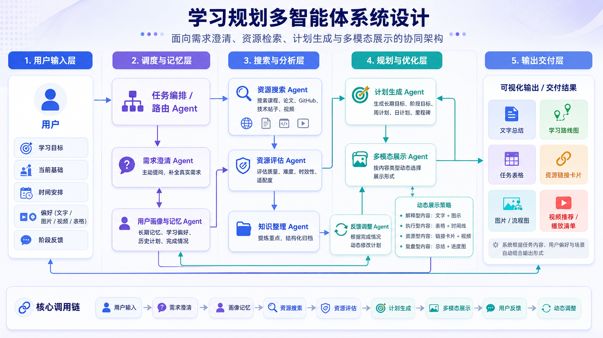
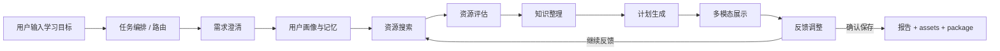

# Study Planner Agent - 智能学习规划多智能体系统

Study Planner Agent 是一个面向个人学习者的本地智能学习规划系统。它把学习目标澄清、用户画像记忆、真实资源检索、资源评估、知识整理、计划生成、多模态展示、反馈调整和最终执行包导出串成一条稳定的多 Agent 主链路。

项目当前支持两种使用方式：

- 本地 Web 工作台：类 ChatGPT/Claude 的对话体验，支持设置模型、联网搜索、全局记忆、主题外观、已保存计划列表和本地文件夹入口。
- 命令行入口：通过 `providers/minimax.py`、`providers/kimi.py`、`providers/deepseek.py` 直接运行多智能体流程。

最终交付不是一份单纯的 Markdown 报告，而是一套可执行学习文件：

```text
plans/<学习目标>/
  <model>-multiagent.md          # 完整最终报告，canonical report
  assets/                        # 封面图、结构图、成果图、产出物图等
  <model>-package/
    plan.md                      # 最终计划副本
    daily-checklist.md           # 每日/每周任务清单
    review-log.md                # 复盘日志模板
    quiz.md                      # 阶段自测题
```

## 系统架构



系统按 5 层组织：

| 层级 | 说明 | 核心模块 |
| --- | --- | --- |
| 用户输入层 | 接收学习目标、当前基础、时间安排、偏好和反馈 | `web/`, `common/agent/multi/interaction.py` |
| 调度与记忆层 | 路由任务、提出澄清问题、生成长期画像 | `RouterAgent`, `ClarificationAgent`, `ProfileMemoryAgent` |
| 搜索与分析层 | 检索学习资源、核验正文、整理知识体系 | `ResourceSearchAgent`, `ResourceEvaluationAgent`, `KnowledgeOrganizationAgent` |
| 规划与优化层 | 生成计划、视觉展示、根据反馈动态调整 | `PlanGenerationAgent`, `MultimodalDisplayAgent`, `FeedbackAdjustmentAgent` |
| 输出交付层 | 输出报告、图片、资源卡片、执行包和本地文件夹 | `pipeline.py`, `package.py`, `display.py` |

固定主链路如下：



## 核心能力

### 1. 需求澄清与画像记忆

系统不会直接把用户的一句话学习目标当成全部上下文，而是先生成 3 到 4 个澄清问题，收集：

- 当前基础水平
- 每周可投入时间
- 理论/实战/项目/考试偏好
- 期望产出形式
- 额外限制或个人偏好

Web 端使用单题卡片交互，选项区域可滚动，输入框也支持直接回答当前题。画像会写入本地长期记忆，后续相似目标会加载历史偏好。

`soul-instr/` 现在作为记忆规则库使用，`ProfileMemoryAgent` 会读取其中的 Markdown 规则，约束画像生成：

- `memory-policy.md`：规定什么该记、什么不该记。
- `profile-schema.md`：规定画像 JSON 字段。
- `memory-merge-rules.md`：规定历史画像、全局记忆和本轮回答如何合并。

### 2. 资源搜索与核验

资源搜索不只依赖模型编写链接。当前实现为多来源、可降级方案：

| 来源 | 用途 | 是否必需 |
| --- | --- | --- |
| Tavily | 通用真实联网检索，按课程、视频、GitHub、博客、论文、文档多路查询 | 可选 |
| MiniMax Web Search MCP | 作为额外搜索源，适合补充中文互联网和国内学习资源，例如 B 站 | 可选 |
| GitHub Search | 补充真实开源项目和高星仓库 | 可选，免 key |
| arXiv Search | 补充真实论文和综述 | 可选，免 key |
| 纯模型生成 | 无搜索 key 或搜索失败时的兜底 | 默认可用 |

资源评估阶段会对候选资源抽样调用 `fetch_url` 抓取正文摘要，再让资源评估 Agent 输出：

- `language`：中文、英文或中英
- `cost`：免费、付费或部分免费
- `relevance`：与学习目标相关度
- `difficulty`：适合阶段
- `use_hint`：先看哪部分、看到什么程度可停、可跳过什么

当用户反馈“换成中文资源”“想要实战项目”“太难了”“想看视频”等资源类诉求时，系统会重新搜索并重新评估资源，而不是只改报告文字。

### 3. 多模态展示

多模态展示 Agent 会根据内容类型选择不同输出形式：

| 类型 | 生成方式 | 说明 |
| --- | --- | --- |
| 知识地图 | M3 图片生成优先，失败回退 SVG | 适合模块化知识体系 |
| 技能依赖图 | M3 图片生成优先，失败回退 SVG | 适合有先修关系的技能 |
| 执行流程图 | M3 图片生成优先，失败回退 SVG | 适合项目、复现、开发任务 |
| 练习循环图 | M3 图片生成优先，失败回退 SVG | 适合考试、语言、技能训练 |
| 学习路线图 | M3 图片生成优先，失败回退 SVG | 由里程碑确定性生成提示词 |
| 产出物清单 | M3 图片生成优先，失败回退 SVG | 有图片 key 时生成视觉化清单 |
| 封面/成果/具象插图 | M3 PNG | 只做气氛和动机 |

结构型图片会把知识模块、步骤、里程碑和产出物转成专门提示词交给图片模型生成。若图片模型不可用、超时或返回失败，系统自动回退本地 SVG，保证报告不会缺图。

### 4. 学习执行包

保存最终计划后会导出执行包：

| 文件 | 面向学习者的用途 |
| --- | --- |
| `plan.md` | 完整最终计划副本，图片路径改写为 `../assets/...` |
| `daily-checklist.md` | 每周任务、每日拆分、里程碑勾选项 |
| `review-log.md` | 按周或前 14 天生成复盘模板 |
| `quiz.md` | 按阶段生成 3 到 5 道自测题，答案折叠展示 |

`quiz.md` 使用一次 LLM 调用生成。若生成失败，系统写入占位说明并继续保存其他文件，不影响主报告。

### 5. Web 工作台

Web 端是本项目当前推荐入口，特点：

- 左侧：已保存计划列表、删除计划、设置入口。
- 中间：智能规划对话、澄清卡片、SSE 实时 Agent 状态、反馈与保存。
- 右侧：本地学习文件夹信息、计划预览、资源卡片。
- 设置：主模型、MiniMax 图生成 Key、Tavily 搜索 Key、全局记忆、日夜间模式、画布背景风格。
- 保存后：自动回到新建学习规划状态，已保存计划会出现在左侧列表。

Web 端不依赖 npm。后端使用 Python 标准库 `http.server` 和项目既有依赖。

## 快速开始

### 环境要求

- Python 3.11+
- Windows PowerShell 或其他终端
- 至少一个主模型 API Key
- 可选：Tavily Key、MiniMax 图生成 Key、MiniMax Web Search MCP 环境

### 安装依赖

```powershell
cd D:\agents\study-planner-agent-main
python -m pip install -r requirements.txt
```

当前 `requirements.txt` 只要求：

```text
httpx>=0.27.0
```

### 启动 Web 工作台

```powershell
python web_app.py
```

默认地址：

```text
http://127.0.0.1:8765
```

如果端口被占用：

```powershell
python web_app.py --port 8770
```

进入页面后，在左下角“设置”中配置：

| 配置项 | 说明 |
| --- | --- |
| 主模型服务商 | MiniMax、Kimi、DeepSeek |
| 主模型 API Key | 用于澄清、规划、评估、反馈等文本任务 |
| 图片生成模型 | 默认 MiniMax-M3，也可切回 image-01 或填写自定义模型 ID |
| MiniMax 图生成 Key | 用于结构图、封面、成果图、产出物清单 PNG |
| Tavily 搜索 Key | 用于真实联网搜索 |
| 全局记忆 | 跨计划生效的长期偏好，例如“优先中文免费资源” |

### 命令行入口

```powershell
python providers/minimax.py
python providers/kimi.py
python providers/deepseek.py
```

命令行会按提示输入 API Key、选择模型、输入学习目标、回答澄清问题，并在反馈环节确认保存。

## 环境变量

| 变量 | 用途 |
| --- | --- |
| `MINIMAX_API_KEY` | MiniMax 主模型、图生成、MiniMax 搜索默认复用 |
| `MOONSHOT_API_KEY` | Kimi 主模型 |
| `DEEPSEEK_API_KEY` | DeepSeek 主模型 |
| `TAVILY_API_KEY` | Tavily 真实联网搜索 |
| `MINIMAX_IMAGE_MODEL` | 可选，覆盖图片生成模型；默认 `m3` |
| `MINIMAX_IMAGE_URL` | 可选，覆盖图片生成接口地址 |
| `MINIMAX_SEARCH_API_KEY` | 可选，单独指定 MiniMax Web Search MCP key |
| `MINIMAX_SEARCH_CMD` | 可选，覆盖 MCP 启动命令 |

示例：

```powershell
$env:MINIMAX_API_KEY = "sk-..."
$env:TAVILY_API_KEY = "tvly-..."
python web_app.py --port 8770
```

MiniMax Web Search MCP 是可选增强。未安装 `uvx` 或 `minimax-coding-plan-mcp` 时，系统会跳过该来源，不影响 Tavily 和主流程。

## 项目结构

```text
study-planner-agent-main/
  README.md
  快速开始.md
  项目交付清单.md
  requirements.txt
  web_app.py

  soul-instr/
    README.md
    memory-policy.md
    profile-schema.md
    memory-merge-rules.md

  web/
    index.html
    app.js
    styles.css

  common/
    agent/
      web_app.py
      multi/
        agents.py
        base_agent.py
        display.py
        interaction.py
        memory_store.py
        package.py
        pipeline.py
        state.py
      tools/
        diagram_render.py
        image_gen.py
        registry.py
        sources.py
        web_search.py
    storage.py

  providers/
    minimax.py
    minimax_impl.py
    kimi.py
    kimi_impl.py
    deepseek.py
    deepseek_impl.py

  tests/
    test_web_app.py
    test_multimodal_images.py
    test_learning_package.py
    test_resource_and_feedback.py
    test_minimax_search.py
    test_image_gen.py
    test_diagram_render.py
    test_pipeline_save.py

  plans/
    <学习目标>/
      <model>-multiagent.md
      assets/
      <model>-package/

  docs/
    assets/
      architecture.png
```

## 测试与验证

常用验证命令：

```powershell
$env:PYTHONPATH='.'
$env:PYTHONIOENCODING='utf-8'
python -m unittest discover -s tests -p "test_*.py"
python -m py_compile common\agent\multi\agents.py common\agent\tools\web_search.py common\agent\web_app.py web_app.py
node --check web\app.js
```

重点测试覆盖：

- Web 设置、主题、画布风格、左右拖拽、SSE 状态流、保存后重置。
- 学习执行包四文件导出和 quiz 失败降级。
- 资源评估正文抓取、新字段渲染和反馈重搜。
- MiniMax 搜索融合 Tavily 结果。
- 多模态图片生成、产出物 PNG 优先和 SVG 兜底。

## 常见问题

### 搜索阶段出现 SSL 错误怎么办？

`[SSL: UNEXPECTED_EOF_WHILE_READING]` 或 handshake timeout 通常是外部 HTTPS 连接被中断，常见于 Tavily 或目标网站访问不稳定。系统会尽量降级继续执行。若资源质量明显下降，可以稍后重试、换网络或配置可用代理。

### 没有图生成 Key 会不会影响计划？

不会。没有 `MINIMAX_API_KEY` 时，AI PNG 会跳过，但本地 SVG 结构图、计划报告和执行包仍会生成。

### 为什么 AI 图里不要求生成文字？

现在结构图会优先走 M3 图片生成，并把节点、步骤、里程碑写进提示词；如果模型生成失败或效果不可用，系统会回退 SVG。封面、成果图等氛围图仍默认要求无文字。

### 保存后为什么页面回到新建规划？

这是当前设计：一次聊天对应一次学习计划。确认保存后，系统冻结最终计划并生成所有学习产物；如果用户想规划新的方向，直接开始新会话即可。已保存计划会保留在左侧列表和 `plans/` 目录。

## 当前状态

项目已经具备端到端学习规划、真实资源检索、资源核验、反馈重搜、多模态展示、学习执行包导出和本地 Web 工作台。适合用于课程展示、个人学习计划生成和后续产品化原型扩展。
