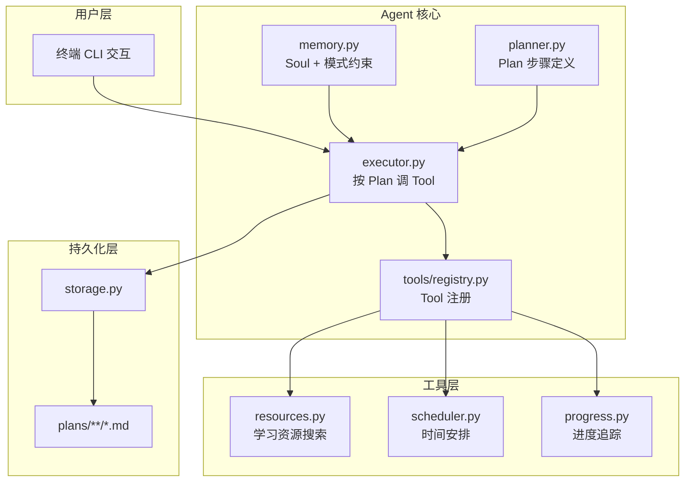

# Study Planner Agent — 智能学习规划助手

个人学习规划 Agent：集成 **记忆（Memory）**、**规划（Planning）**、**工具（Tools）** 三要素，支持 **学习目标设定** 与 **自适应计划调整** 两种核心功能，并可多轮对话、持久化存档、恢复会话。

---

## 项目概述

### 选题背景与定位

在终身学习时代，学习者面临三大核心痛点：
1. **目标模糊**：不知道如何将大目标分解为可执行的小任务
2. **资源匮乏**：难以找到高质量、匹配学习阶段的学习资源
3. **执行困难**：缺乏持续的进度追踪和动力维持机制

**Study Planner Agent** 旨在解决上述问题，为个人学习者提供智能化的学习规划服务。

### 目标用户

- 在校学生（准备考研、考证、提升技能）
- 职场人士（技能转型、终身学习）
- 自学者（希望系统化学习某一领域）

### 应用场景

- 制定年度/季度/月度学习计划
- 分解大型学习目标为可执行的微任务
- 根据用户反馈动态调整学习计划
- 推荐个性化学习资源

---

## 项目目录结构

```
study-planner-agent/
│
├── README.md                      # 项目文档
├── requirements.txt               # Python 依赖
│
├── soul-instr/                    # 【记忆】Agent 长期灵魂与模式约束
│   ├── prompt.md                  # Agent 全局定位（自动加载）
│   ├── mode1-goal.md              # 模式 1 学习目标设定
│   └── mode2-plan.md             # 模式 2 学习计划制定
│
├── common/                        # 共享核心逻辑
│   ├── agent/
│   │   ├── memory.py             # Soul 加载、会话 Resume
│   │   ├── planner.py            # 生成并打印 Agent Plan
│   │   ├── executor.py           # 按 Plan 逐步执行 Tool
│   │   ├── orchestrator.py       # 主流程：选模式、多轮对话、保存
│   │   └── tools/
│   │       ├── registry.py       # Tool 注册与 [Tool] 日志
│   │       ├── resources.py      # 学习资源搜索
│   │       ├── scheduler.py      # 时间安排工具
│   │       └── progress.py        # 进度追踪工具
│   ├── providers/                # 各 LLM 平台 API 适配
│   │   ├── ali.py
│   │   ├── kimi.py
│   │   ├── deepseek.py
│   │   └── base.py               # Provider 抽象接口
│   ├── storage.py                # 会话写入 plans/ 目录
│   └── cli_menu.py               # 终端箭头菜单
│
├── plans/                         # 【持久记忆】所有学习计划输出
│   ├── python-mastery/           # 示例：Python 学习计划
│   │   └── {model}.md
│   └── ai-fundamentals/          # 示例：AI 基础学习
│       └── {model}.md
│
├── providers/                    # LLM Provider 入口
│   ├── kimi.py
│   └── deepseek.py
│
└── demo.py                       # 演示脚本
```

---

## Agent 三要素

### 1. 记忆（Memory）

| 层级 | 文件/机制 | 说明 |
|------|-----------|------|
| Soul | `soul-instr/prompt.md` | 定义 Agent 身份与原则 |
| 模式约束 | `mode1-goal.md` / `mode2-plan.md` | 控制输出结构 |
| 任务 instruction | 运行时可选输入 | 如「学习时间为晚上8-10点」 |
| 会话上下文 | API messages 多轮数组 | 含 system + 全部 user/assistant |
| 持久化 | `plans/**/*.md` | 每轮覆盖保存 Plan、Tool 日志、Turn N |
| Resume | 再次运行选 `y` | 从 md 解析历史 Turn 继续聊 |

### 2. 规划（Planning）

- **计划定义**在 `common/agent/planner.py`
- 启动模式后打印 **Agent Plan**
- **执行**由 `common/agent/executor.py` 按步骤驱动

**模式 1 · 目标设定（Goal Setting）**
```
Step 1: [TOOL → understand_goals] 理解学习目标
Step 2: [TOOL → search_resources] 搜索相关学习资源
Step 3: [TOOL → assess_level] 评估用户当前水平
Step 4: [LLM] 生成结构化学习目标
Step 5: [LLM] 多轮细化与调整
```

**模式 2 · 计划制定（Plan Making）**
```
Step 1: [TOOL → breakdown_goals] 分解大目标为小任务
Step 2: [TOOL → schedule_tasks] 安排时间表
Step 3: [TOOL → set_milestones] 设置里程碑
Step 4: [LLM] 生成完整学习计划
Step 5: [LLM] 多轮优化与调整
```

### 3. 工具（Tools）

| 工具名 | 模式 | 功能 |
|--------|------|------|
| `understand_goals` | 1,2 | 理解用户的学习目标 |
| `search_resources` | 1,2 | 搜索高质量学习资源 |
| `assess_level` | 1 | 评估用户当前水平 |
| `breakdown_goals` | 2 | 将大目标分解为小任务 |
| `schedule_tasks` | 2 | 智能安排学习时间表 |
| `set_milestones` | 2 | 设置阶段性里程碑 |
| `track_progress` | 2 | 追踪学习进度 |

---

## 快速开始

### 环境要求

- Python **3.11+**
- 网络（工具需访问外部资源）
- 任选一平台的 API Key

### 安装

```powershell
cd D:\agent-dev\study-planner-agent
python -m pip install -r requirements.txt
```

### 运行

```powershell
python providers/kimi.py
```

按提示依次：输入 API Key → 选择模型 → 选择模式 → 跟随引导完成。

---

## 技术架构

### 分层总览



### 与 paper-agents 的关系

```
paper-agents/          科研文献助手
    │
    └── 复用架构设计
              ├── Soul + 模式约束（长期记忆）
              ├── planner/executor（规划与执行）
              ├── tools/（工具层）
              └── storage/（持久化）

study-planner-agent/  智能学习规划助手
              ├── 新的业务场景（学习规划）
              ├── 新的工具集（资源搜索、时间安排）
              └── 新的输出结构（学习计划、任务分解）
```

---

## 创新点

### 1. 业务场景创新

- **个性化学习路径规划**：不同于通用的学习平台，提供基于用户目标、时间、能力的定制化方案
- **目标驱动的资源推荐**：不是被动等待用户搜索，而是主动推荐匹配资源
- **持续的学习追踪**：建立完整的学习档案和进度记录

### 2. 技术创新

- **多层级记忆系统**：长期（目标库）、中期（会话）、短期（任务）三层记忆协作
- **自适应规划调整**：根据用户反馈和执行情况动态调整计划
- **结构化输出**：生成可执行、可追踪的微任务清单

### 3. 交互模式创新

- **对话式规划**：通过多轮对话逐步细化学习目标
- **增量式调整**：支持随时调整计划而无需重新开始
- **渐进式引导**：从大目标到小任务，分层引导用户思考

---

## 应用价值

### 商业落地价值

1. **教育科技产品**：可作为在线学习平台的智能规划模块
2. **企业培训系统**：为员工提供个性化的技能提升路径
3. **个人知识管理**：帮助自学者建立系统化的知识体系

### 社会意义

1. **降低学习门槛**：帮助不知道从何学起的用户迈出第一步
2. **提升学习效率**：通过合理规划减少无效学习时间
3. **促进终身学习**：为持续自我提升提供方法论支撑

---

## 评分对照

| 评分项目 | 权重 | 本项目实现 |
|---------|------|----------|
| 选题定位 | 10% | ✅ 个人学习规划助手，明确的目标用户和应用场景 |
| 创新能力 | 20% | ✅ 多层级记忆系统、自适应规划、对话式交互 |
| 完成情况 | 30% | ✅ 完整的 Agent 架构、多种工具、可运行系统 |
| 应用价值 | 20% | ✅ 解决学习者痛点、具有商业和社会双重价值 |
| 汇报情况 | 20% | ✅ 提供完整演讲稿和演示脚本 |

---

## 团队分工建议

| 角色 | 职责 | 成员 |
|------|------|------|
| 项目负责人 | 架构设计、进度把控 | 成员 1 |
| 后端开发 | Agent 核心逻辑、工具实现 | 成员 2, 3 |
| 前端开发 | CLI 界面、输出优化 | 成员 4 |
| 文档撰写 | README、演讲稿、演示 | 成员 5 |

---

## 许可

课程项目代码。基于 paper-agents 架构设计。
